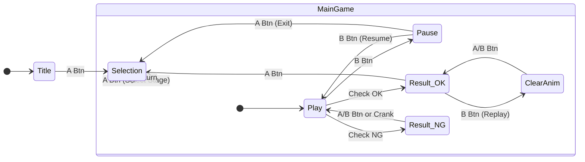

# ぐるパラ！ (GuruPara!) 開発仕様書

## 1. プロジェクト概要

Playdate専用のパラパラアニメ並べ替えパズルゲーム。
クランク入力による「物理的なめくり」と、バラバラになったコマの順序を推測するロジックパズル。

* **プラットフォーム**: Playdate
* **開発言語**: Lua (Playdate SDK)
* **言語設定**: 英語のみ
* **販売価格**: $3.00 (予定)

---

## 2. コンテンツボリューム

**総ステージ数: 28問**（4行×7列のグリッド配置）

| 分類 | ステージ数 | コマ数 | 備考 |
| --- | --- | --- | --- |
| **Tutorial** | 1問 | 4コマ | 左上（インデックス0）。基本操作の学習用。 |
| **Alphabet** | 26問 | 9コマ | A〜Zをモチーフにしたアニメ。 |
| **Boss** | 1問 | 16コマ | 右下（インデックス27）。高難易度。 |

※ 現在の実装では全ステージが初期から選択可能。将来的にアンロック機能を追加予定。

---

## 3. シーン構成 (Scene Flow)



---

## 4. 入力マッピング (Input Mapping)

| 入力 | Title | Selection | MainGame | Pause (Overlay) |
| --- | --- | --- | --- | --- |
| **クランク** | - | カーソル移動 | **コマ送り / 挿入位置選択** | - |
| **十字キー** | - | カーソル移動 | **押している間: コマをつかむ (Grab)**<br>**離す: コマを置く (Drop)** | - |
| **Aボタン** | Start | 決定 | **答え合わせ (Check)** | Selectionへ戻る |
| **Bボタン** | - | 進捗表示 | **ポーズ開閉** | ゲーム再開 |
| **Menu** | System | System | System | System |

### MainGame 特有操作の詳細

* **コマの移動 (Grab & Drop)**
  1. **十字キー押下**: 表示中のコマを保持（左上にサムネイル表示、メイン画面は右下にオフセット）。
  2. **クランク回転**: 保持したまま挿入位置を選択。
  3. **十字キー離す**: その位置にコマを挿入。

* **サムネイルの演出**:
  * 右辺と下辺に波打つ黒い枠線（風になびく紙の表現）
  * 黒線の外側に白い縁取り
  * 右下に角丸表現
  * 掴む/置く時に線の太さと透明度がアニメーション

* **巻き戻しアイコン**: クランクを逆回転させると、画面中央に巻き戻しアイコン（◀◀）を表示。

* **操作ヒント**: 無操作が2秒続いた場合、左下に「A:CHECK」を表示。

---

## 5. デザイン・アセット仕様 (Design Specs)

Figmaのデザインデータを正とするが、以下の**Playdateハードウェア制約**を最優先する。

### 禁止事項 (Figma/Implementation)

* **中間色の禁止**: 白(#FFFFFF)か黒(#000000)のみ使用。グレーはディザリングで表現。
* **透明度の禁止**: Alpha値は使用不可。
* **エフェクト禁止**: ブラー、ドロップシャドウ等は使用しない。
* **指定外フォント**: 下記指定以外のフォントは使用しない。

### フォント運用

* **使用フォント**: Roobert (Playdate SDK システムフォント)
* **サイズ**: 20px (UI/Body), 24px (Title), 11px (ボタンアイコン)
* **ボタンアイコン**: Roobert-11-Medium フォントに含まれる専用グリフを使用
  * `Ⓐ` `Ⓑ` - A/Bボタン
  * `✛` - D-pad
  * その他: `🟨` `🎣` `⬆️` `➡️` `⬇️` `⬅️`

---

## 6. シーン詳細仕様 (Scene Logic)

### 6.1. Title Scene

* **機能**: 設定ロード、スタート待機。
* **表示**: ロゴ、ふわふわアニメーションする "PRESS Ⓐ TO START"。

### 6.2. Selection Scene

* **機能**: ステージ選択ハブ。
* **表示**:
  * 4行×7列のタイルグリッド（各50x50px、間隔5px）
  * 未クリア: グレータイルに文字表示（?, A-Z, ?）
  * クリア済み: アニメーションサムネイル（全フレームがループ再生）
  * コーナーブラケットスタイルのカーソル
* **Bボタン**: 進捗オーバーレイを表示（クリア数/総数、達成率%）

### 6.3. MainGame Scene

* **初期化**: 画像ロード後、Fisher-Yates法で配列をシャッフル。正解にならないまでシャッフルを繰り返す。
* **コマ送りアニメーション**:
  * **進む方向（スライドアウト）**: 白い台紙が左へスライドアウト。紙のエッジはカーブ表現、影付き。
  * **戻る方向（スライドイン）**: 白い台紙が左からスライドイン。縦方向のスケール変化でめくり効果を表現。
* **判定 (Check)**: `Aボタン` 押下時、現在の配列が「循環順序（例: 2,3,4,1 や 1,2,3,4）」であればクリア。
* **ポーズメニュー**: `Bボタン` でオーバーレイを表示。
  * 現在の経過時間、ベストタイム表示
  * `B`: ゲーム再開
  * `A`: Selectionへ戻る
* **リザルト**:
  * **OK（クリア）**: タイム表示、ハイスコア更新時は「Best Time!」表示。`A`でSelection、`B`でクリアアニメ再生。
  * **NG（失敗）**: 「Something seems to be wrong...」表示。`A`/`B`/クランクで閉じて再挑戦。

### 6.4. Tutorial (Stage 0)

ステージ0はチュートリアル専用。4コマのシンプルなアニメーションで基本操作を学習。

**ステップ構成:**

| Step | 説明 | 操作 |
| --- | --- | --- |
| **Step 1** | クランク操作を学ぶ | クランクを回すとStep 2へ |
| **Step 2** | 十字キーで掴む | 十字キーを押し続けるとStep 3へ |
| **Step 3** | 並び替える | 正しい順番に並べるとStep 4へ |
| **Step 4** | 答え合わせ | Ⓐボタンでチェック |

**チュートリアル固有の制限:**
* Step 1完了前は十字キー無効（クランク操作の学習を強制）
* チュートリアル未クリア時、ポーズ画面からSelectionへ戻れない
* オーバーレイはアイドル状態が一定時間続くと自動表示

---

## 7. サウンド仕様 (Audio)

### BGM

システムメニューでON/OFF切り替え可能（設定保存）。

| ID | ファイル名 | 使用シーン |
| --- | --- | --- |
| `title` | `bgm_natsuyasuminotanken.mp3` | Title |
| `selection` | `bgm_natsuyasuminotanken.mp3` | Selection |
| `game` | `bgm_fjordnosundakaze.mp3` | MainGame |

### SE (効果音)

シンセサイザーによるリアルタイム生成:

* `playFlip`: クランクでのコマめくり音（進む方向）
* `playFlipBack`: クランクでのコマめくり音（戻る方向、より短い）
* `playGrab` / `playRelease`: コマのつかみ/置き音
* `playOK` / `playNG`: 答え合わせ結果音
* `playCursor`: カーソル移動音

サンプルファイル再生:

* `playClear`: クリア時の「おめでとう」音声（`se_omedetou.mp3`）
* `playSelected`: 決定音（`se_selected.mp3`）

---

## 8. 技術構成 (Architecture)

### ディレクトリ構造

```
Source/
├── main.lua              # エントリーポイント、シーン分岐、システムメニュー
├── game/                 # [AI管理] ゲームロジックモジュール（main.luaからリファクタリング）
│   ├── state.lua         # ゲーム状態管理 (GameState)
│   ├── tutorial.lua      # チュートリアル状態・オーバーレイ (Tutorial)
│   ├── renderer.lua      # 描画関数 (Renderer)
│   └── input.lua         # クランク・ボタン入力処理 (Input)
├── ui/                   # [AI管理] View/描画ロジック
│   ├── title.lua         # タイトル画面
│   └── selection.lua     # ステージ選択画面
├── core/                 # [AI管理] ゲームコアロジック
│   ├── puzzle.lua        # 判定、シャッフル、配列操作
│   ├── sound.lua         # オーディオ管理（BGM/SE）
│   ├── debug.lua         # デバッグ表示
│   └── transition.lua    # シーン遷移エフェクト
├── config/               # [人間管理] 調整パラメータ
│   ├── settings.lua      # 感度、アニメーション、UI定数
│   └── stages.lua        # ステージ自動検出
├── fonts/                # .fntフォントデータ
│   └── Roobert/          # Playdate SDK システムフォント
│       ├── Roobert-11-Medium.fnt   # ボタンアイコン用
│       ├── Roobert-20-Medium.fnt   # UI/Body用
│       └── Roobert-24-Medium.fnt   # Title用
├── images/               # 画像リソース
│   └── {index}_{name}/   # 各ステージのアニメ画像
└── sounds/               # 音声ファイル（BGM, SE）

```

### セーブデータ (`playdate.datastore`)

```lua
{
    hiScores = {
        whale = 12345,        -- クリアタイム（ミリ秒）
        ramen = 23456,
        -- ... アニメーション名ごとのハイスコア
    },
    bgmEnabled = true,        -- BGM設定
    lastSelectedStage = 0,    -- 最後に選択したステージ
    sensitivity = "Normal"    -- クランク感度
}
```

* **タイミング**: ステージクリア時、設定変更時、ステージ選択時。

### システムメニュー

Playdate OSの仕様により、カスタムメニュー項目は**最大3つ**まで追加可能。

| 項目 | 種類 | 説明 |
| --- | --- | --- |
| debug | チェックボックス | デバッグ情報の表示切替 |
| BGM | チェックボックス | BGMのON/OFF |
| Crank | 選択式 | クランク感度（Slow/Normal/Fast/Fastest） |

※ 新しいメニュー項目を追加する場合は、既存の項目を削除する必要がある。

---

## 9. 用語集 (Glossary)

コードおよびコミットログでは以下の英語定義を使用する。

| カテゴリ | 日本語 | 英語 (Code) | 定義 |
| --- | --- | --- | --- |
| **Object** | コマ | `Frame` | アニメーションの1枚絵 |
|  | ステージ | `Stage` | 1問の問題単位 |
|  | 正解ID | `TargetID` | そのコマの本来のインデックス |
| **Action** | つかむ | `Grab` | 十字キー押下中の状態 |
|  | 置く | `Place` / `Drop` | 十字キーを離して挿入する動作 |
|  | めくる | `Flip` | クランクによる表示切り替え |
|  | 答え合わせ | `Check` | 正誤判定処理 |
| **Logic** | 循環順序 | `Cyclic Order` | ループ再生で矛盾しない順序 (例: 2,3,1) |
|  | 正順 | `Canonical Order` | 完全な整列 (例: 1,2,3) |
| **Animation** | スライドアウト | `Slide Out` | コマが左へ出ていくアニメ（進む方向） |
|  | スライドイン | `Slide In` | コマが左から入ってくるアニメ（戻る方向） |

---

## 10. ツール (Tools)

### 10.1. pdc (Playdate Compiler)

Playdate SDK付属のコンパイラ。Luaソースコードと画像/音声リソースを `.pdx` パッケージにコンパイルする。

**実行方法:**

```bash
# プロジェクトルートで実行
cd /Users/takashi/RiderProjects/gurupara-dev2

# ビルドのみ
pdc Source gurupara.pdx

# ビルド後にシミュレータで実行
pdc Source gurupara.pdx && open gurupara.pdx
```

**出力:**
- `gurupara.pdx/` - Playdate実行可能パッケージ（シミュレータまたは実機で実行可能）

### 10.2. その他のツール

`Tools/` ディレクトリに開発支援ツールが格納されています。詳細は `Tools/README.md` を参照してください。

- **create_selection_sprite.py** - セレクション画面用スプライトシート生成
- **validate_animation_images.py** - アニメーション画像の命名規則検証

